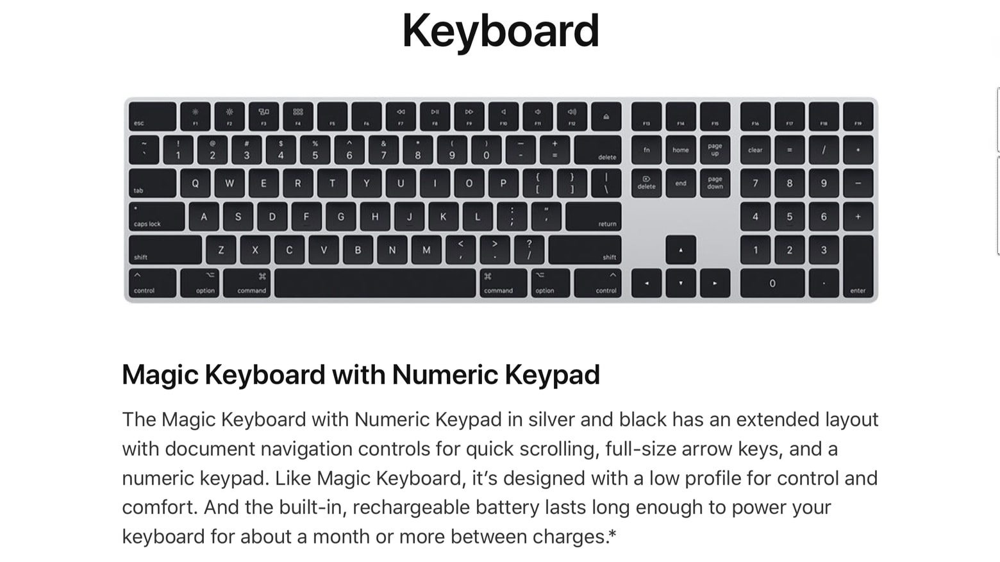

# Alfred: Toggle Fn Function Keys On/Off in OSX Catalina+

Simple Alfred Script to toggles Function Keys in OSX Catalina using Apple Script  

### Requirements

[Alfred 4.](https://www.alfredapp.com/)

### Why?

Did you just figure out that your $6k Mac Pro ships with a silver and black Magic Keyboard that somehow doesn't have a function key to enable you toggle between OS functions and number function keys. 

Bind this to whatever you want a you are sorted.